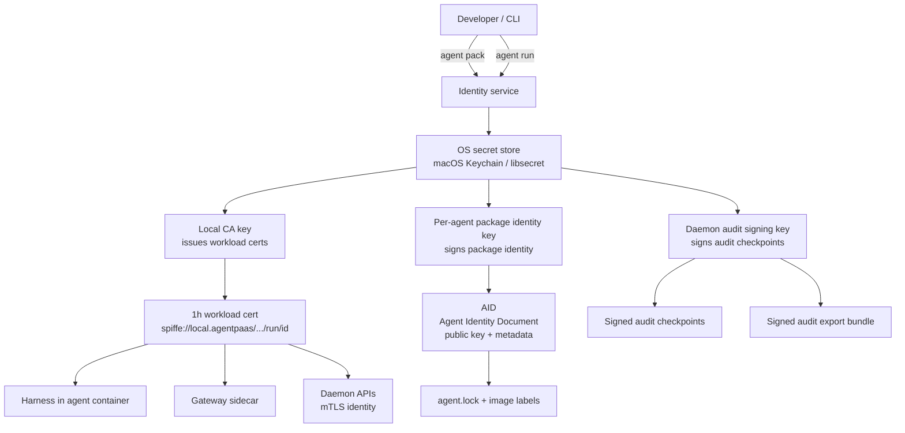
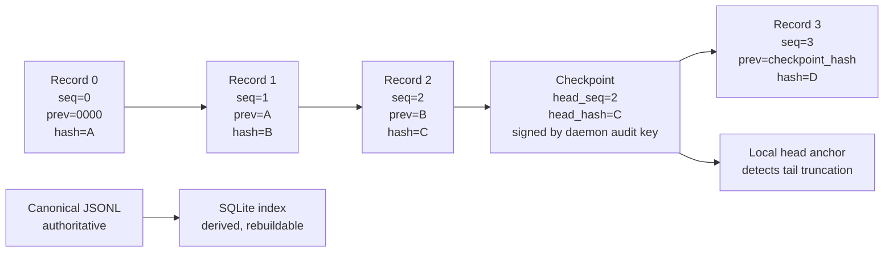
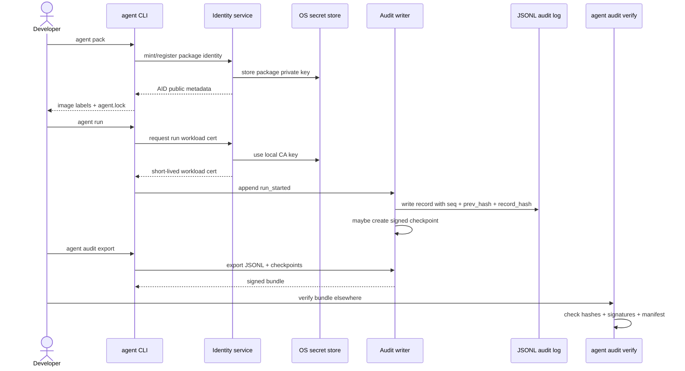
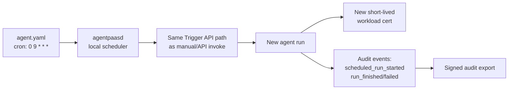
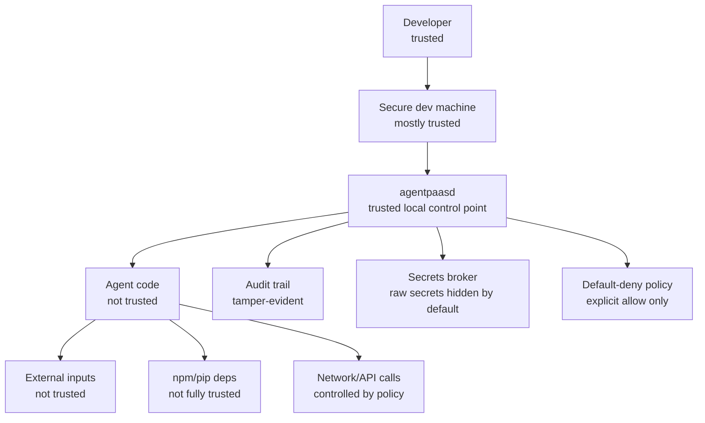
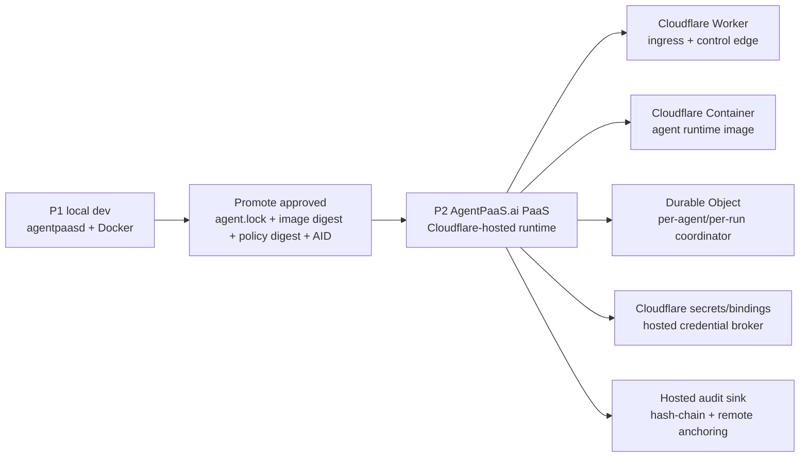
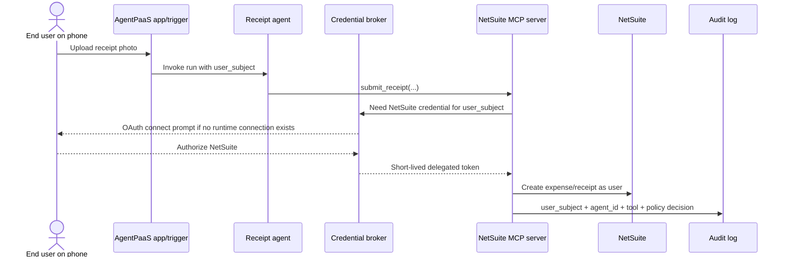

# AGENTPAAS PRD v4.0 — MASTER DOCUMENT (Technical Cofounder Edition)
**Status:** Ready for founder review → then build Phase 1 end-to-end
**Companion:** `agentpaas-execution-plan-v1.md` (block-by-block build plan with prompts, tests, success gates)
**Supersedes:** v2.0 PRD, v3.0 advisor memo
**Date:** June 2026

---

# 1. PRODUCT DEFINITION

## 1.1 One-liner
AgentPaaS is the governed local-first runtime that turns AI-generated agent
code into a signed, sandboxed, policy-controlled, fully audited workload in
one command.

## 1.2 The wedge (fixed from v2.0)
- **Source of agents:** AI coding tools (Claude Code, Codex, Hermes, Cursor).
- **Blocker we remove:** security/platform sign-off. AI-written code + live
  credentials + autonomous egress = "no" from every security team today.
- **Buyer:** staff platform engineer (champion), VP Eng/CISO (economic buyer).
- **User (Phase 1):** the developer who just had an agent generated and wants
  to run it on their machine without leaking keys or letting it call
  arbitrary endpoints. Local mode must be frictionless: `brew install
  agentpaas && agent pack && agent run`. No Kubernetes, no cloud account,
  no signup, no telemetry without opt-in.

## 1.3 Personas (corrected from v2.0)
| Persona | Phase | Relationship | What they need |
|---|---|---|---|
| Developer using coding agents | P1 | OSS user, advocate | Zero-friction safe local runtime; instant observability; never hand-writes Docker flags |
| Platform engineer | P1–P2 | Champion → buyer | Policy-as-code in git, signed artifacts, SBOM, audit export, fleet view (P2) |
| Security engineer / CISO | P2 | Approver → economic buyer | Default-deny egress, tamper-evident audit, secrets never in images, compliance pack |
| Ops power user (RevOps etc.) | P3 | End user of blessed registry | Form-based launch of pre-approved agents; never sees containers |

## 1.4 Product principles
1. The security engineer's "yes" is the product.
2. Consume standards (MCP, A2A, OCI, OTel, SPIFFE-style identity, cosign,
   agentgateway); own the experience (harness, identity, policy UX, audit,
   packaging).
3. Local-first is a trust posture: zero telemetry leaves the machine without
   explicit opt-in — and we prove it: our own binaries' egress is governed
   by the same policy engine users can inspect.
4. One command, one signed artifact, one audit trail per agent.
5. Deployment topology (single container vs sidecar) is a flag, never a concept.
6. Secure by default, overridable only by explicit, logged, git-versioned policy.

## 1.5 Explicit non-goals (Phase 1)
- No agent authoring framework (LangGraph/CrewAI/plain loops are inputs).
- No model-cost routing in P1 (budgets land in P1, smart routing P3).
- No cloud control plane, no private registries, no A2A orchestration in P1.
- No Windows-native in P1 (macOS + Linux; Windows via WSL2, documented).
- No marketplace until 50+ paying logos.

---

# 2. ARCHITECTURE (NORMATIVE)

## 2.1 Component map
```
┌────────────────────────── Developer machine ───────────────────────────┐
│  agentpaas CLI  (Go, single static binary)                             │
│   ├─ agent init / pack / run / stop / logs / policy / audit / doctor   │
│   └─ talks to agentpaasd over gRPC on unix socket                      │
│                                                                         │
│  agentpaasd  (Go daemon, launchd/systemd user service)                  │
│   ├─ RuntimeDriver: Docker Engine API (containerd/Podman behind iface)  │
│   ├─ Trigger API   REST :7717 + gRPC :7718  (loopback only by default)  │
│   ├─ Dashboard     web UI :7700              (loopback only by default) │
│   ├─ OTel collector (in-process) → SQLite trace store (WAL)             │
│   ├─ Audit service: hash-chained JSONL + SQLite index + signed export   │
│   ├─ Identity service: per-agent ed25519 identity, local CA, SVIDs      │
│   ├─ Secrets broker: keychain backed, gateway injection + scoped leases │
│   └─ Event bus: webhooks + NATS-style local pub/sub for hooks           │
│                                                                         │
│  Per agent: ONE logical deployable unit                                 │
│   ┌──────────── agent container ────────────┐                           │
│   │ harness (PID 1, Go)                      │                          │
│   │  ├─ lifecycle: init/run/checkpoint/stop  │                          │
│   │  ├─ budgets: tokens / $ / wall-clock /   │                          │
│   │  │            max-iterations             │                          │
│   │  ├─ health endpoints + OTel emit         │                          │
│   │  └─ exec: user agent code (Py / Node)    │                          │
│   └───────────────────────────────────────────┘                         │
│          │ internal-only bridge, NO default route                       │
│          ▼                                                              │
│   ┌──────── gateway sidecar container ──────┐                           │
│   │ agentgateway (Rust, pinned release)      │                          │
│   │  ├─ ingress: authenticated trigger route │                          │
│   │  └─ egress: THE ONLY network path out    │                          │
│   └───────────────────────────────────────────┘                         │
│   agent image is cosign-signed with SBOM; gateway sidecar is supplied   │
│   by agentpaasd from a pinned, checksummed AgentPaaS release            │
└──────────────────────────────────────────────────────────────────────────┘
```

## 2.2 Technology choices and why
| Choice | Rationale |
|---|---|
| Go for CLI/daemon/harness | Single static binaries → trivial brew/curl install; first-class Docker/containerd/gRPC/OTel libs; fast cold start |
| agentgateway sidecar, pinned | LF-governed, Rust, MCP/A2A/LLM-aware. We vendor a checksummed release and run it as a sidecar container. Our IP = policy compiler that emits its config + enforcement topology |
| Docker Engine as P1 substrate | Every target dev has Docker Desktop/colima. `RuntimeDriver` interface from day 1 so containerd/Podman are additive |
| SQLite (WAL) locally | Zero deps, file-based, easy export, concurrent dashboard reads |
| gRPC daemon↔CLI on unix socket | Filesystem permissions = auth; no TCP attack surface |
| Protobuf-first APIs | Trigger API defined in proto; REST generated via grpc-gateway → one source of truth |
| Loopback-only by default | `--expose` requires configured API key; refuses to start exposed without auth |

## 2.2.1 Local runtime conventions (P1)
- P1 container substrate is Docker Engine API. Supported paths: Docker
  Desktop, Colima's Docker-compatible socket, and Linux `dockerd`.
  Rootless Docker is best-effort only in P1, not a release gate, because the
  easiest secure path is the common Docker Engine API surface. Podman and
  containerd are future `RuntimeDriver` implementations, not P1 gates.
- AgentPaaS state lives under `~/.agentpaas` by default, created 0700:
  `daemon.sock` (0600), `agentpaasd.pid`, `logs/`, `state/`, `config/`,
  `cache/`, and `tmp/`. Developer/test overrides: `AGENTPAAS_HOME`,
  `AGENTPAAS_SOCKET`, `AGENTPAAS_DASHBOARD_PORT`,
  `AGENTPAAS_TRIGGER_REST_PORT`, `AGENTPAAS_TRIGGER_GRPC_PORT`.
- `agentpaasd` runs as the current user via launchd/systemd user services.
  It refuses to run as root unless `--allow-root-for-test` is supplied.
- `agent version` and `agent daemon status` show CLI version, daemon version,
  proto version, build commit, OS/arch, Docker context, and Docker API
  version.
- All daemon logs are structured JSON with redaction enabled from day one.
  Secret-looking values are masked before log emission, even before the
  secrets broker block lands.

## 2.3 Gateway-only network enforcement model (the defensible core)
Local enforcement must be REAL, not advisory env-var proxying. Both inbound
traffic to the harness and outbound traffic to the internet go through the
gateway sidecar. The daemon never calls the harness directly.
1. Agent container attaches ONLY to a Docker network created with
   `internal: true` — no NAT, no default route. DNS inside resolves only
   through the gateway's DNS stub.
2. The gateway sidecar attaches to BOTH the internal network and a dedicated
   AgentPaaS egress network. The gateway is the only ingress path to the
   harness and the only egress path to upstream services. P1 does not use
   host networking for the gateway. The agent container never shares the
   gateway's network namespace.
3. Harness also sets `HTTP(S)_PROXY` + offers an SDK shim as conveniences —
   but the network topology is the control. An agent that ignores the proxy
   has no route to the internet and callers cannot skip the gateway to reach
   the harness.
4. Policy = default-deny. One human-readable `policy.yaml` is the canonical
   source for egress, credentials, MCP servers, and hook destinations. Allow
   entries are exact by default: `domain: api.example.com` means only that
   hostname, not subdomains. Wildcards such as `*.example.com` require an
   explicit `allow_wildcard: true` acknowledgment; private CIDRs require
   `allow_private: true`. Policy is compiled to agentgateway config at
   `agent run`. SNI, Host header, and DNS answers are cross-checked to
   defeat domain fronting.
5. Every allowed AND denied call → audit event: timestamp, agent identity,
   destination, method, bytes, status, payload SHA-256, token count, cost
   estimate, decision + matching policy rule.
6. Edge cases handled explicitly (each has a test in the execution plan):
   raw-IP dialing (no route — blocked), DNS exfiltration (DNS only via
   stub, NXDOMAIN for non-allow-listed, query rate-limited + logged),
   IPv6 disabled for P1 agent networks, UDP (blocked except DNS-to-stub),
   container-to-host (`host.docker.internal`, gateway IP probing, Docker
   bridge gateway probing, and local daemon ports blocked because nothing is
   directly reachable from the agent), websockets/SSE through gateway
   (supported, logged per-frame-batch), redirects disabled by default for
   credentialed brokered requests and otherwise re-evaluated against policy
   per hop, CONNECT tunneling to non-allow-listed ports (denied).

## 2.4 Identity model
The identity service keeps signing authority separate from workload identity.
P1 has four local identity classes:
1. **Local CA key:** stored in the OS secret store and used only to issue
   short-lived workload certificates.
2. **Daemon audit signing key:** a separate Ed25519 key stored in the OS
   secret store; it signs audit checkpoints and export manifests. Its public
   key fingerprint is the local trust anchor shown by `agent doctor` and
   included in audit exports.
3. **Per-agent package identity key:** minted by `agent pack`; public key +
   agent metadata = the Agent Identity Document (AID), embedded in image
   labels and recorded in `agent.lock`. The private key is held by the
   identity service for packaging/signing only. Rotating this key creates a
   new AID; the same name/version with a different public key is treated as
   a distinct identity unless explicitly rotated.
4. **Per-run workload key/cert:** generated at `agent run`; daemon issues a
   1h, auto-renewed SPIFFE-style certificate
   (`spiffe://local.agentpaas/agent/<name>/<ver>/run/<run_id>`). Harness and
   gateway receive only this short-lived workload credential on tmpfs and it
   is discarded at stop.
- Workload certificates are used for trigger-API client auth and
  gateway/harness-to-daemon mTLS. They identify the source of audit events,
  but they do not sign the canonical audit trail; audit checkpoints and
  exports are signed only by the daemon audit signing key.
- The local CA, daemon audit key, and package identity private keys live in
  macOS Keychain or Linux libsecret. A file keystore fallback is allowed only
  when explicitly initialized by the user, encrypted with a passphrase, mode
  0600 under `~/.agentpaas`, and warned by `agent doctor`. There is no silent
  plaintext fallback.

## 2.4.1 Audit chain model
- The audit JSONL is the authoritative record. SQLite is a derived index for
  search/dashboard queries and can be rebuilt from JSONL.
- Each audit record has a stable schema version, monotonic sequence number,
  wall-clock timestamp, event type, agent identity, run id where applicable,
  policy/image digests where applicable, payload hashes instead of payload
  bodies, `prev_hash`, and `record_hash`.
- `record_hash` is SHA-256 over canonical JSON with `record_hash` omitted.
  `prev_hash` is the previous record's `record_hash`; the genesis value is a
  fixed all-zero hash. Ordering is by sequence number; wall-clock movement
  never reorders the chain.
- A single daemon-owned audit writer serializes appends. Security-relevant
  actions that require auditability (run start/stop, egress allow/deny,
  credential injection/lease, budget kill, trigger auth failure) fail closed
  if the audit record cannot be durably appended.
- Signed checkpoint records are inserted into the same chain at a fixed
  cadence (record-count or time interval) and at export. Each checkpoint is
  signed by the daemon audit signing key over `{head_seq, head_hash,
  previous_checkpoint_hash, created_at}`.
- Local verification checks JSONL chain continuity, checkpoint signatures,
  checkpoint cadence, SQLite/index consistency, and the latest local head
  anchor maintained by the daemon. This catches middle edits, reordering,
  checkpoint deletion, and tail truncation relative to the daemon's last
  known head.
- `agent audit export` writes a signed bundle containing the JSONL segments,
  checkpoint records, AIDs/public keys, trust metadata, and an export
  manifest signed by the daemon audit signing key. Verification on a second
  machine proves bundle integrity and signature validity. It does not claim
  global transparency-log guarantees or prove that a fully compromised local
  machine could not have deleted all local state before export.

## 2.4.2 Block 3 security walkthrough and local threat model
Block 3 is the trust spine. It does not yet implement the full network
sandbox, secrets broker, or scheduler. It establishes the local identities,
short-lived workload credentials, and tamper-evident audit trail that later
blocks depend on.

The simplest mental model:
- The developer and the developer's secure machine are trusted enough to run
  the local supervisor.
- `agentpaasd` is the trusted local control point.
- AI-generated agent code, its external inputs, its dependencies, and its
  network behavior are not trusted by default.
- Scheduled local runs must go through the same supervised path as manual
  runs. Cron must not become a backdoor around identity, policy, budget,
  secrets, or audit.

### Identity roles


Each identity has one job:
- **Local CA key:** issues short-lived run certificates, so long-lived signing
  authority is not placed inside containers.
- **Workload certificate:** proves which specific run is talking to the
  daemon/gateway/harness path.
- **Package identity key:** ties `agent.lock`, image labels, and security
  review to a stable agent identity.
- **Daemon audit signing key:** signs audit checkpoints and exports
  independently from the workload identity.

Workload certificates identify event sources, but they do not sign the
canonical audit trail. The daemon audit signing key signs the audit trail.
This separation prevents a compromised or confused workload credential from
being treated as authority over the audit record itself.

### Audit chain


Why each piece exists:
- **Canonical JSONL:** portable source of truth for review and export.
- **SQLite index:** fast dashboard/search path, but not trusted as the source
  of truth.
- **Hash chain:** catches edits, deletion in the middle, and reordering.
- **Signed checkpoints:** make history tamper-evident at known intervals.
- **Local head anchor:** catches local tail truncation, where an attacker
  deletes the newest records instead of editing middle records.
- **Signed export bundle:** lets a security reviewer verify integrity on a
  second machine.

Second-machine verification proves that the exported bundle is internally
consistent and signed by the expected daemon audit key. It does not prove a
fully compromised local machine could not have deleted all local evidence
before export. That stronger guarantee would require a future transparency
log or remote anchoring service, which is not a P1 claim.

### Step-by-step run flow


### Scheduled local runs
Local cron-style agents are supported by the overall P1 architecture, but the
cron scheduler itself is implemented later in Block 9. The security rule is
that a scheduled run must be just another trigger source. It goes through the
same Trigger API, identity, policy, budget, secrets, egress, and audit path
as an interactive run.



Cron makes the controls more important because the agent may run unattended
for days or weeks. Scheduled execution must never bypass the same guardrails
that apply when a developer manually runs the agent.

### Who is the adversary on a secure developer machine?
On a secure local development machine, the primary adversary is usually not
the developer. The adversary is the untrusted behavior around the agent:
1. **AI-generated or buggy agent code** may call the wrong API, loop forever,
   send data to an unintended endpoint, or mishandle credentials.
2. **Prompt injection** may arrive through email, tickets, docs, Slack, web
   pages, PDFs, invoices, or any other data the agent reads.
3. **Compromised dependencies** from npm, PyPI, or transitive packages may
   try to read files, inspect environment variables, or phone home.
4. **Over-broad or stolen credentials** can be misused if exposed directly to
   agent code, which is why brokered credentials are the default.
5. **Automation drift** can turn a safe-looking local experiment into a
   recurring unattended process; audit, budgets, identity, and policy make it
   bounded and reviewable.
6. **Local malware or full machine compromise** is only partially addressed
   in P1. AgentPaaS avoids plaintext secrets where possible and makes audit
   tampering evident, but it does not claim to defeat a fully compromised
   developer machine.



AgentPaaS's P1 trust posture is: trust the developer and local supervisor
enough to govern execution; do not automatically trust the AI-written agent,
its inputs, its dependencies, or its network behavior.

## 2.4.3 Phase 2 cloud portability guardrails
Phase 2 should let a developer take an agent that was packed, tested, and
approved locally, then promote the same governed runtime to an AgentPaaS.ai
hosted PaaS. The expected cloud substrate is Cloudflare: Workers for ingress
and control edges, Containers for running agent images, Durable Objects for
per-agent/per-run coordination and state, Cloudflare secrets/bindings for
hosted credentials, and Cloudflare Access/service auth where useful.

Block 3's P1 design supports that direction if the implementation treats
local identity, local storage, and local audit anchoring as replaceable
backends, not as product semantics.



The P1 choices that must remain portable:
- **AID is environment-independent.** The Agent Identity Document should
  describe the agent artifact and approval unit, not the local machine. It
  must be valid when promoted from local Docker to hosted Cloudflare runtime.
- **Issuer is pluggable.** P1 uses a local CA from the OS secret store.
  P2 can use an AgentPaaS-hosted issuer or tenant-scoped issuer. Code should
  depend on an issuer interface, not directly on macOS Keychain, libsecret,
  or local filesystem paths.
- **SPIFFE trust domain is not hardcoded to local.** P1 may issue
  `spiffe://local.agentpaas/...` certificates, but the URI builder/verifier
  must allow a future hosted trust domain such as
  `spiffe://tenant.agentpaas.ai/<tenant>/agent/<name>/<ver>/run/<run_id>`.
- **Audit signer is environment-scoped.** P1 signs with the local daemon
  audit key. P2 should sign with a tenant/project audit key and optionally
  remote-anchor checkpoints. Export verification should accept explicit trust
  metadata rather than assuming "this laptop's daemon key."
- **Audit storage is abstract.** P1's canonical JSONL + SQLite index is
  excellent for local mode. P2 may store the same canonical records in a
  hosted audit sink backed by Durable Objects, R2, D1, or another managed
  store. The record schema and verification algorithm must stay portable.
- **Run identity includes deployment context.** Run records should have room
  for `deployment_mode` (`local|hosted`), `tenant_id`/`project_id` when
  hosted, and region/runtime metadata when available. P1 can leave hosted
  fields empty.
- **Promotion is by digest, not rebuild.** P2 should consume the local
  `agent.lock`, image digest, policy digest, AID, and SBOM. Rebuilding in the
  cloud may be offered later, but the first hosted path should preserve the
  exact artifact the developer tested.

What not to do in P1:
- Do not bake OS keychain APIs into audit or identity business logic.
- Do not make `local.agentpaas` the only valid trust domain.
- Do not define audit verification as "read files from `~/.agentpaas`."
- Do not make local daemon identity equal tenant identity.
- Do not require direct host filesystem semantics in record schemas.
- Do not let cron/scheduled runs bypass Trigger API semantics; hosted
  schedules must use the same trigger path.

What P1 should do for speed:
- Implement only local backends first: OS secret store, local CA, local audit
  key, JSONL, SQLite, local head anchor.
- Keep the interfaces narrow: `KeyStore`, `IdentityIssuer`, `AuditWriter`,
  `AuditAnchor`, `AuditVerifier`, and `AuditExporter`.
- Add cloud-portability tests at the contract level only: alternate trust
  domain strings, explicit deployment metadata fields, bundle verification
  without local filesystem assumptions, and an in-memory/fake keystore.
- Defer hosted issuer, remote audit anchoring, tenant RBAC, Cloudflare
  deployment, and cloud secrets broker implementation to Phase 2.

## 2.5 Secrets model
- Secrets registered once: `agent secret set OPENAI_API_KEY` → stored in
  macOS Keychain / libsecret. NEVER in images, generated secret files, env
  files, compose files, Docker labels, or packed artifacts. The P1
  `SecretStore` abstraction has macOS Keychain, Linux libsecret, and explicit
  fake test-store implementations only; there is no silent plaintext
  fallback.
- `agent secret set` reads values from stdin or an interactive prompt, never
  argv. Individual secret values are capped at 64 KiB. `agent secret list`
  shows metadata only: id, created time, updated time, last used time, and
  referenced policies/agents. It never shows the value, prefix, suffix, or
  hash-derived hints.
- Secret store names are case-sensitive local-profile entries with no
  whitespace or control characters. Policy credential ids are policy-local
  stable ids that bind egress/MCP rules to those store names; one stored
  physical secret can be referenced by multiple reviewed policies, but every
  agent must opt in through its own policy binding.
- Default mode is brokered outbound credentials: `policy.yaml` binds a
  keychain secret to a specific allowed egress rule and a header injection
  template. At runtime, the gateway sidecar injects the credential into the
  approved outbound request, normally as `Authorization` or another
  app-specific header. The agent never receives the raw secret value. P1
  deliberately does not support query-string or body credential injection:
  query strings leak through URLs/logs too easily, and body rewriting is
  harder to reason about, test, and audit. Services that require body-level
  credentials need an adapter/MCP server or an explicit future policy
  extension.
- For brokered credentials, the agent sends an unsigned logical HTTP/LLM/MCP
  request to the gateway via the SDK or configured proxy. The gateway
  validates policy, injects the credential, and originates the upstream TLS
  request. Raw TLS/socket attempts from the agent cannot receive brokered
  credential injection and have no direct internet route.
- Compatibility mode is direct agent file lease: `policy.yaml` must explicitly
  request `mode: file_lease` with a reason. File leases are mounted only at
  runtime from tmpfs with 0400 perms, owner = agent uid, and removed at stop.
  P1 does not support env leases because environment variables are too easy to
  leak through process inspection, crash dumps, dependency behavior, logs, and
  `/proc`.
- `agent secret revoke <name>` invalidates brokered credential use
  immediately and restarts any agent with an active direct lease. Direct-lease
  revocation stops future access after restart, but it cannot claw back a
  secret value already visible to agent code.
- Pack-time scanner refuses to build images containing high-entropy strings
  / known key formats (gitleaks rules) unless `--allow-secret-pattern`
  (logged, discouraged).

### 2.5.1 Secret access guarantees (P1)
- We guarantee secrets are not baked into agent images, image layers,
  Docker labels, compose files, or default environment variables.
- We guarantee brokered outbound credentials are not exposed to agent code:
  they are fetched by the daemon/gateway path and injected only after the
  destination, method, port, and policy rule match.
- We guarantee brokered credential use is audited as `secret_injected` with:
  agent identity, run id, credential id, destination, policy rule id, and
  `visible_to_agent=false`.
- We guarantee a brokered credential cannot be used for a different
  destination, method, port, redirect target, or request shape than the policy
  rule permits. Credentialed redirects are disabled by default; noncredentialed
  redirects are re-evaluated against policy per hop.
- We guarantee a direct lease cannot exist unless `policy.yaml` explicitly
  opts into `file_lease`. For security review purposes, a direct lease means
  "this run had access to this secret."
- We do not guarantee P1 can prove every raw read of a directly leased file.
  The SDK can emit precise `secret_read` audit events for lease helpers, but
  arbitrary user code can bypass the SDK once a direct lease is mounted.

### 2.5.2 Future enterprise managed-secret posture
Corporate rollout has a stricter trust problem than individual local mode:
business technology/security teams may want employees to run governed agents
on laptops behind the corporate VPN, but they may not allow long-lived
business credentials to be copied onto employee machines without additional
controls.

This is not a P1 build requirement, but it is a required future design review
before team/enterprise deployment. Options to evaluate:
- cloud or corporate-network secrets broker where raw secrets remain in a
  managed vault and the local gateway receives only short-lived, scoped use
  authorization or request-time injection
- device posture checks, MDM enrollment, disk encryption, and corporate VPN /
  network-location requirements before granting credential use
- per-user delegated authorization for enterprise apps, including revocation
  and user-level audit
- tenant-admin policy that can disable direct leases entirely
- remote audit anchoring so credential use from employee machines is visible
  to the organization even if a laptop later goes offline or is compromised

The principle for that future block: local agents may run on employee
machines, but enterprise secrets should not have to permanently reside there.
Credential use should be brokered, short-lived, policy-scoped, revocable, and
audited under tenant control.

## 2.6 Data flow (runtime)
- **Trigger (inbound):** caller → daemon Trigger API (REST/gRPC, API-key or
  workload-cert auth) → daemon validates + audits → routes via gateway
  ingress → harness `run` hook → agent code. The daemon never calls the
  harness directly, even on the same host.
- **Agent outbound:** agent → (proxy/SDK or raw socket attempt) → gateway
  egress → policy check → optional brokered credential injection → upstream
  (LLM/MCP/API) → response; both directions traced (OTel) and audited.
- **Events (outbound hooks):** daemon event bus emits
  `agent.started|finished|failed|budget_exceeded|egress_denied|secret_injected|secret_leased`
  → local webhooks (user-configurable, themselves policy-checked) and the
  dashboard live stream (SSE).
- **Observability:** harness + gateway emit OTLP → in-process collector →
  SQLite → dashboard. `agent audit export` produces hash-chained, signed
  JSONL + verification command.

## 2.7 API surfaces (P1)
1. **Trigger API** (proto: `api/trigger/v1/trigger.proto`)
   - `Invoke(agent, payload, idempotency_key) → run_id`
   - `InvokeStream(...) → stream of events` (gRPC server-stream / REST SSE)
   - `GetRun(run_id)`, `CancelRun(run_id)`, `ListRuns(agent, filter)`
   - Auth: `Authorization: Bearer <api-key>` or mTLS workload cert.
   - Errors: google.rpc.Status; idempotency on key replay returns original run.
2. **Control API** (daemon↔CLI, unix socket gRPC): Pack, Run, Stop, Logs,
   PolicyApply, SecretSet/Grant/Revoke, AuditQuery/Export, Doctor.
3. **Harness contract** (inside container): agent code implements either
   (a) HTTP contract: `POST /invoke`, `GET /healthz`, `GET /readyz` on
   localhost:8000, or (b) SDK contract (P1: Python `agentpaas-sdk`):
   `@agent.on_invoke`, `agent.llm()`, noncredentialed `agent.http()`,
   brokered `agent.http_with_credential()`, and `agent.mcp()` helpers that
   route through the gateway with tracing and brokered credential use baked
   in. Agent-level checkpoint/resume is deferred to P2 and is not a P1 SDK
   promise; audit-log checkpoints remain part of the Block 3 security model.
   `agent.secrets.file()` exists only for explicit direct-lease compatibility
   mode and is discouraged in generated code. The harness listens only inside
   the agent container's private network namespace; all external callers,
   including the daemon, reach it through the gateway ingress path.
4. **Event hooks:** `hooks:` section in `policy.yaml` → URL or local command
   per event type; deliveries signed (HMAC w/ per-hook secret), retried 3x
   with backoff, dead-lettered to audit log.
5. **Scheduling:** `triggers: cron: "0 9 * * *"` in agent.yaml → daemon
   cron service invokes via the same Trigger API (so scheduled runs are
   audited identically).

## 2.7.1 MCP access, delegated user access, and orchestration boundary
AgentPaaS has two MCP roles that must stay distinct:
1. **Agent as MCP client:** a governed agent calls local or remote MCP
   servers to use tools and data sources. This is part of the runtime
   security surface.
2. **AgentPaaS as MCP server:** coding tools call AgentPaaS MCP tools such as
   `pack_agent`, `run_agent`, and `query_audit`. This is the distribution
   integration built in Block 12.

P1 must support the first role at a basic governed level:
- Local and remote MCP servers must be declared in `mcp.yaml` and referenced
  from `policy.yaml`; dynamic MCP tool discovery never auto-allows new tools.
- Local MCP servers run only as daemon-managed child processes, sidecars, or
  explicitly declared local endpoints. They receive minimal environment, no
  raw secrets by default, and the same audit/redaction controls as agents.
- Remote HTTP MCP servers are reached only through the gateway egress path.
  Their domains, ports, auth mode, and allowed tools are policy-reviewed.
- MCP auth follows the MCP authorization model for HTTP transports where
  available: OAuth-style protected-resource discovery, authorization-server
  metadata, and bearer tokens. In P1, AgentPaaS supports service/app
  credentials via the secrets broker; interactive per-end-user authorization
  is a P2 feature.
- Every MCP tool call is audited with agent identity, run id, server id,
  tool name, input/output payload hashes, credential id if used, user subject
  if present, decision, and policy rule id.

Phase 2 adds **Verified User Access-style delegated access**: actions can
execute as the end user, not only as the agent/service account. The Workato
pattern is the right mental model: a parent connection defines the approved
app/integration, while runtime user connections let each end user authenticate
with their own OAuth credentials; tool/actions then respect that user's
permissions and produce user-level audit trails.

For AgentPaaS this means:
- P1 trusted subject = agent/run identity.
- P2 trusted subjects = agent/run identity **plus** end-user identity and
  delegated credential context.
- P1 credentials = brokered service/app credentials and explicit direct
  leases only.
- P2 credentials = runtime user connections, OAuth consent, per-user token
  vaulting, revocation, and user-level authorization checks at tool-call time.

Example P2 flow:


Multi-agent workflows, loops, master/worker patterns, and agent chaining are
also P2. P1 should not build an orchestration product. It should preserve the
right primitives: run ids, parent/child run correlation ids, triggering
subject, policy decision records, and audit events that can later explain
"who/what caused this action."

Agent-level checkpoint/resume and half-done job recovery are also P2. P1
restarts failed runs from a fresh container and records enough structured
failure context for a future control-plane repair loop. P2 must revisit
long-running and partially completed jobs explicitly, including idempotency,
external side effects, resume state, and operator-visible recovery decisions.

## 2.8 Packaging pipeline (`agent pack`)
Input: a directory with `agent.yaml` (+ code). Steps, all deterministic:
1. Detect Python framework (plain Python, LangGraph, CrewAI) or use explicit
   `runtime:` field. Node and custom Dockerfile packaging are deferred.
2. Secret scan (gitleaks ruleset) over the full source tree and the effective
   build context — fail closed. `.agentpaasignore` controls the build context,
   not whether a checked-in secret is acceptable.
3. Dependency resolution into a locked layer (uv), recorded; dependency
   advisory summary is surfaced in pack output.
4. Build OCI image: distroless base, non-root uid 64000, read-only rootfs,
   tmpfs /tmp, no shell in final image, harness as PID 1.
5. Generate SBOM (syft, SPDX-json) — attached as an OCI artifact in the local
   OCI layout and referenced from the lockfile.
6. Sign locally with cosign using the per-agent package identity key. This is
   local key-backed signing, not Sigstore keyless OIDC/Fulcio signing. The P1
   trust root is the AID public key recorded in the lockfile and audit/export
   metadata; future release/enterprise flows may add Fulcio/Rekor or tenant
   trust roots.
7. Emit a canonical, signed `agent.lock` manifest — the unit a security
   reviewer approves in a PR and the exact artifact `agent run` consumes.

`agent.lock` contains at minimum: schema version, agent name/version,
runtime/framework, target platform, base image digest, harness version, build
input digest, image digest, SBOM digest, policy digest, package AID/public
key, signature bundle/referrer locations, and reproducibility metadata. The
manifest is canonical JSON and is itself signed by the package identity key.
`agent verify agent.lock` wraps the offline verification path, including
lockfile signature verification, image signature verification with the AID
public key, digest checks, SBOM digest checks, and policy digest checks.

## 2.9 agent.yaml + policy.yaml (the developer contract)
```yaml
# agent.yaml
name: invoice-chaser
version: 0.1.0
runtime: python3.12          # P1: python3.12; node/custom Dockerfiles deferred
entry: main:app              # module:callable or HTTP-contract
description: Chases overdue invoices via email
triggers:
  api: true
  cron: "0 9 * * 1-5"
budgets:
  max_iterations: 50
  max_wall_clock: 15m
  max_tokens: 200000
  max_usd: 5.00              # estimate via provider price table
resources:
  memory: 512Mi
  cpu: "1.0"
```
```yaml
# policy.yaml  (lives in git next to the agent; reviewed in PRs)
version: 1
egress:
  default: deny
  require_credential_binding: false
  allow:
    - domain: api.openai.com
      ports: [443]
      category: llm
      credential: openai-prod
    - domain: api.stripe.com
      ports: [443]
      methods: [GET]
      credential: stripe-readonly
    - domain: hooks.slack.com
      ports: [443]
      methods: [POST]
      category: webhook
    - mcp_server: filesystem-readonly
      tools: [read_file, list_directory]
credentials:
  brokered:
    - id: openai-prod
      secret: OPENAI_API_KEY       # keychain item; never visible to agent
      inject:
        header: Authorization
        value: "Bearer ${secret}"
    - id: stripe-readonly
      secret: STRIPE_RO_KEY
      inject:
        header: Authorization
        value: "Bearer ${secret}"
  direct_leases:
    - id: legacy-tool-token
      secret: LEGACY_TOOL_TOKEN
      mode: file_lease             # P1 compatibility mode; env leases unsupported
      mount_path: /run/agentpaas/secrets/LEGACY_TOOL_TOKEN
      reason: "Legacy SDK only supports reading a token file"
mcp_servers:
  - id: filesystem-readonly
    transport: stdio
    command: agentpaas-mcp-filesystem
    args: ["--root", "./data", "--readonly"]
    env: {}
    allow_secrets: []
hooks:
  egress_denied:
    - url: http://127.0.0.1:9999/security-alert
ingress:
  auth: api_key               # api_key | mtls
```

Policy schema rules for P1:
- `policy.yaml` is the only canonical policy file. It may include sections
  for egress, credentials, MCP servers, hooks, and ingress. Generated examples
  should optimize for being easy for a human or LLM to compose correctly.
- Gateway egress behavior is configurable through policy. P1 supports
  noncredentialed HTTP only for explicitly allowed destinations; setting
  `egress.require_credential_binding: true` forces outbound HTTP calls through
  named credential bindings.
- Unknown fields are errors. Typos should fail closed instead of silently
  weakening security.
- Domain matching is exact by default. `domain: example.com` does not allow
  `api.example.com`; use an explicit subdomain or a wildcard with
  `allow_wildcard: true`.
- Canonical policy is the review and audit unit. The compiler sorts maps and
  unordered lists deterministically, normalizes method names to uppercase,
  lowercases and ASCII-normalizes domains, expands defaults, removes comments,
  deduplicates equivalent rules with a warning, and produces the
  `policy_digest`. YAML key order and comments must not affect the digest.
- IDNs are accepted only after conversion to canonical ASCII punycode.
  Confusable-character detection and display-name UX are deferred; when in
  doubt, require the developer to specify the ASCII hostname explicitly.
- Brokered credential injection is header-only in P1. Query-string and body
  injection are rejected by validation.
- Direct leases are file-only in P1. `env_lease` is rejected by validation.
  Real secret files must never be generated into the source tree, build
  context, image layers, or packed artifacts; generated code should create
  credential references and policy entries, not real secret files.
- Secret-related CLI, dashboard, runtime, and validation errors must redact
  values and must not reveal value prefixes, suffixes, or hash-derived hints.
- Hook destinations are validated in Block 4 as policy data and revalidated
  at delivery time in Block 9. Remote hook URLs must match an egress allow
  rule; loopback hook URLs are allowed only as explicit local hooks and are
  never reachable from the agent container.

## 2.10 Dashboard (P1 scope, intentionally small)
Single-page app served by daemon (embedded assets, no CDN at runtime):
- Agent list: status, uptime, last run, spend-to-date vs budget.
- Run detail: timeline of traces (LLM calls w/ tokens+cost, MCP calls,
  egress events incl. DENIED in red), logs, audit checkpoint markers.
- Policy view: effective policy per agent, diff vs git file.
- Audit search: filterable, with one-click signed export.
- Live event stream (SSE). No auth on loopback; API-key when `--expose`.

---

# 3. SECURITY DEEP-DIVE (BULLETPROOFING ACTIONS)

## 3.1 Threat model (STRIDE-condensed)
| Threat | Vector | Control |
|---|---|---|
| Malicious/buggy AI-generated code exfiltrates secrets | outbound HTTP/DNS/raw socket | brokered credentials are not visible to agent code; internal-only network, gateway-only egress, DNS stub, default-deny, payload-hash audit |
| Secret theft from image/registry | keys baked into layers | keychain broker + gateway-side injection by default; direct leases explicit only; pack-time scanner |
| Prompt-injected agent calls unauthorized tools | MCP/tool call to non-approved server | MCP allow-list by server id + per-tool policy (P2: per-tool args constraints) |
| Container escape | kernel/runtime exploit | non-root, read-only rootfs, no shell, dropped capabilities (ALL), seccomp default profile, no privileged, pids-limit, memory/cpu caps |
| Supply chain (our deps) | compromised base image / dep | distroless pinned digests, SBOM on every artifact, `go mod verify`, dependabot, pinned vendored agentgateway with checksum |
| Supply chain (user deps) | typosquatted Python package | locked installs only (uv), SBOM surfaced in dashboard, osv-scanner advisory in `agent pack` output |
| Trigger API abuse | replay / brute force | idempotency keys, constant-time key compare, rate limit, lockout+audit on repeated 401 |
| Audit tampering | attacker edits logs | canonical hash-chained JSONL, daemon-audit-key checkpoint signatures, local head anchor, signed export manifest, `agent audit verify` |
| Daemon compromise | local privilege escalation | daemon runs as user (not root); socket 0600; no setuid; secrets only via OS keychain APIs |
| Malicious webhook targets | hook exfiltration channel | hook destinations are themselves policy-checked egress |
| Dashboard exposure | accidental 0.0.0.0 bind | loopback default; `--expose` refuses to start without API key + warns; CSRF tokens; strict CSP, no inline JS |
| Domain fronting | SNI ≠ Host | gateway cross-checks SNI/Host/DNS answer; mismatch = deny + audit |

## 3.2 Hard security actions (all are execution-plan blocks)
1. seccomp + AppArmor (Linux) profiles shipped and applied by default.
2. Fuzz the policy compiler and the Trigger API (go-fuzz / protobuf fuzz).
3. `agent doctor` verifies: docker version, network isolation actually
   holds (spins a canary container and proves no default route), keychain
   access, port collisions.
4. Integration test suite includes an adversarial "red team agent" image
   that attempts: raw IP dial, DNS tunnel, /etc/passwd read, proxy bypass,
   host.docker.internal access, IPv6 escape, discovering brokered secrets in
   env/files/proc (must find zero), using a brokered credential for the wrong
   destination (denied), and copying a directly leased secret file to an
   ALLOWED domain (P1 best-effort: known-secret fingerprint match on
   outbound bodies). The red-team suite is a permanent CI gate — every
   release must show 0 escapes.
5. External pentest before GA tag; bug bounty (modest, scoped) at GA.
6. SLSA provenance for our own release artifacts; users can verify
   `agentpaas` binaries the same way we verify their agents.
7. Security disclosure policy + SECURITY.md from the first public commit.
8. CVE response SLA stated publicly: critical < 48h patch for the runtime.

## 3.3 What we explicitly do NOT claim in P1 (honesty = trust)
- Not a sandbox against kernel 0-days (we harden containers; we are not gVisor).
  P2 option: gVisor/Kata runtime class for high-assurance mode.
- Outbound data-loss prevention is fingerprint-based, not semantic, in P1.
- Local mode trusts the developer's machine; we protect against the AGENT,
  not against the user.

---

# 4. CODING-TOOL INTEGRATIONS (DISTRIBUTION-AS-PRODUCT)

This is the highest-leverage distribution channel and it is buildable now.

## 4.1 Claude Code (plugin — confirmed extensibility surface)
Claude Code supports Plugins that bundle Skills + Hooks + MCP servers.
Build `agentpaas` plugin:
- **Skill** `deploy-agent`: when the user says "deploy/run this agent
  safely", the skill scaffolds `agent.yaml` + `policy.yaml` (inferring
  egress needs from the code's HTTP calls — propose, never auto-allow),
  runs `agent pack`, then `agent run`, returns dashboard URL.
- **PreToolUse hook**: optional guardrail intercepting Claude Code's Bash
  tool when it tries `docker run` on raw agent code — suggests `agent run`
  ("governed alternative available").
- **MCP server** `agentpaas-mcp`: exposes `pack_agent`, `run_agent`,
  `get_run_status`, `query_audit` as MCP tools so Claude Code operates the
  runtime conversationally.
- Distribution: publish to community plugin marketplaces + our own tap.

## 4.2 Hermes
- Hermes skill `agentpaas-deploy` (SKILL.md): trigger phrases, exact CLI
  commands, pitfalls, verification. Hermes drives the full loop via its
  terminal tool. Cheap to build; we dogfood it during development.

## 4.3 Codex / Cursor / generic
- Codex: AGENTS.md instruction pack + the same MCP server (Codex speaks MCP).
- Cursor: rules file + MCP.
**Decision: the MCP server is THE single integration artifact; per-tool
skins (skill, plugin, rules) are thin wrappers around it.**

---

# 5. GO-TO-MARKET & DISTRIBUTION (DETAILED)

## 5.1 Sequence
1. **Weeks 1–3 (parallel with build): validation.** 15 conversations with
   platform/security engineers (Workato network, LinkedIn, 2 CISO intro
   asks). Script: show the demo storyboard, ask "what would your security
   team need to see to approve this?" Target: 5 design partners.
   Kill condition: <5 partners from 15 talks → re-aim wedge before more code.
2. **Months 1–3: build P1 per execution plan**, partners get weekly builds.
3. **Month 3–4: OSS launch.** Apache-2.0 runtime; BSL control plane later
   (stated publicly day one). Launch assets: 3-min egress-block demo video,
   "Letting AI-written agents into prod: a security checklist" post, HN
   launch, MCP server listed in registries, Claude Code plugin in
   marketplaces.
4. **Months 4–9: channel grind.** LangGraph/CrewAI "deploy to production"
   docs PRs; 2 talks (AI Engineer Summit, KubeCon AI day); monthly
   security-angle content. Gate to P2 build: 1,000 weekly-active runtimes
   (opt-in ping only) OR 25 self-reported production deployments.

## 5.2 Pricing posture (publish early, even pre-revenue)
- Individual/local: free forever, all security features included. Never
  paywall single-machine safety.
- Team (P2): per-fleet pricing, target $99–$299/mo starting tiers.
- Enterprise (P2/P3): SSO, RBAC, registry, retention, support — $30–60k ACV
  initial, $100k+ with compliance pack.

## 5.3 Metrics
- Activation: code → governed running agent < 15 min (p50), < 30 min (p90).
- Aha: >60% of first sessions view an audit log or a blocked-egress event.
- Adoption: weekly-active runtimes; 3+-dashboard-user installs = sales signal.
- Revenue: 5 partners → 3 paying by month 12 → $250k ARR by month 18.

---

# 6. LANDING PAGE CHANGES (agentpaas.ai) — FOR ENTERPRISE BUYERS & VCs

Current page audit (live copy pulled June 2026): leads with "millions of
autonomous agents", "self-expanding workspace", "auto-tuned memory" —
Phase-3 vision language with no proof. Enterprise buyers discount it;
VCs read it as unfocused. Integrations grid (Gmail, Salesforce...) implies
a shipped iPaaS that doesn't exist — credibility risk.

## 6.1 Rewrite — section by section
1. **Hero:**
   - H1: "Ship the agent your AI just built. Safely."
   - Sub: "AgentPaaS packages AI-generated agents into signed, sandboxed,
     policy-controlled containers — with default-deny egress and a complete
     audit trail. One command. Runs on your machine. Open source."
   - CTA primary: "brew install agentpaas" (copyable). CTA secondary:
     "Watch the 3-minute demo." Kill "Request early access" as primary —
     OSS dev tools convert on install, not on forms.
2. **Replace abstract feature grid with the 60-second story** (terminal
   animation): Claude Code writes agent → `agent pack` (shows signing+SBOM)
   → `agent run` → dashboard → agent tries unauthorized call → BLOCKED,
   audit entry appears → `agent audit export`. This is the whole pitch.
3. **"Built for the people who say no" section** targeting security:
   default-deny egress · secrets never in images · signed artifacts + SBOM ·
   tamper-evident audit · zero phone-home. Each links to docs.
4. **Honesty fixes:** remove the integrations grid (or relabel "works with
   anything your policy allows — examples"); remove "millions of agents",
   "auto-tuned memory", "automated cost optimization" until shipped; move
   vision items to a clearly-labeled Roadmap page (VCs like a roadmap;
   they punish vapor presented as product).
5. **Proof bar:** GitHub stars widget, Linux Foundation/agentgateway
   "built on" badge, design-partner logos when permitted, "as discussed in
   <talk/post>" links as they land.
6. **For VCs (quietly):** an /about page with the why-now narrative
   (agent creation is commoditized by coding agents; governance is the
   bottleneck; window 12–24 months), founder background (Workato PM —
   integration/automation domain depth), and the open-core model. VCs who
   land on dev-tool pages look for: traction numbers, a wedge they can
   repeat in one sentence, and evidence of velocity (changelog page —
   add one).
7. **Keep:** navy+rose brand, robot mark (resized per prior session),
   clean layout. The bones are fine; the words are the problem.

---

# 7. RISKS (CARRIED FROM v3.0, UNCHANGED IN SUBSTANCE)
Platform absorption (HIGH, 12–24mo window) · execution capacity (HIGH —
mitigated by this LLM-driven build plan + cofounder/funding decision) ·
category timing (MED-HIGH) · OSS→paid conversion (MED) · security product
burden (MED — mitigated by §3) · standards churn (MED) · brand (LOW).

# 8. SUCCESS DEFINITION FOR PHASE 1 (THE CONTRACT WITH OURSELVES)
Phase 1 is DONE when all of the following are demonstrably true:
1. On a clean macOS and a clean Ubuntu machine: install → first governed
   agent running in < 15 minutes following only the README.
2. The red-team agent suite (§3.2.4) shows 0 escapes across all 10 attack
   classes, in CI, on both platforms.
3. A LangGraph agent, a CrewAI agent, and a plain-Python agent each pack and
   run without a custom Dockerfile.
4. Claude Code (via plugin) and Hermes (via skill) can each take freshly
   generated agent code to running-governed state conversationally.
5. `agent audit export` output passes `agent audit verify` on another
   machine, and a deliberately tampered line is detected.
6. Budget enforcement kills a runaway loop at exactly the configured caps
   (tokens, USD, wall-clock, iterations) with correct audit events.
7. 5 design partners have run a real agent of their own through it; ≥3 say
   they would show the audit export to their security team.

**END OF PRD v4.0 — see agentpaas-execution-plan-v1.md to build it.**
